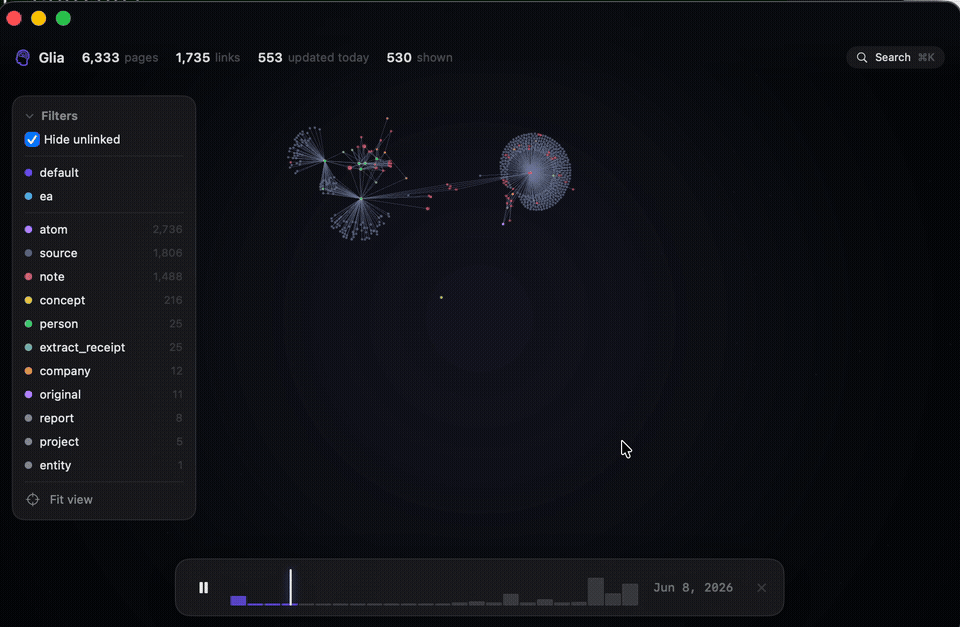

# Glia

[](https://github.com/draphael89/glia/actions/workflows/ci.yml)
&nbsp;
&nbsp;

**A native macOS window into your agent's brain — watch it learn in real time.**



*Above: 6,300 pages of an agent's knowledge assembling itself over one month — the growth replay, captured live.*

Glia renders a [gbrain](https://github.com/garrytan/gbrain) knowledge base as a living
constellation: every page a lit orb, every typed link a thread, laid out with a
Barnes-Hut force engine and drawn by Metal. New knowledge blooms into a *stable*
map — your brain's geography stays where you learned it.

> Status: early. Built native-first in Swift 6 / SwiftUI / Metal. No web views.

## Features

- **The graph** — GPU-rendered (instanced SDF orbs, MSAA, 120Hz), colored by page
  type, sized by connectivity. Pinch to dive, two-finger pan, double-click to fly.
- **Growth replay** — scrub or play the brain's history and watch months of
  learning assemble itself in seconds. New pages bloom in place.
- **⌘K search** — type, arrow, return: the camera flies to the node.
- **Focus mode** — click a node: its neighborhood stays lit, everything else
  recedes. Inspector shows type, dates, connections, and deep-links into Obsidian.
- **Stable spatial memory** — layout settles once and persists. No perpetual
  physics soup; insertions relax locally and the map you know stays the map.
- **Menu-bar presence** — page count and today's activity at a glance.

## Data

First launch with no data shows a friendly empty state: **Explore the Demo**
(a bundled synthetic brain — try every feature immediately) or **Choose Brain
Folder…** (⌘O; sandbox-safe security-scoped bookmark, remembered across
launches). By default Glia reads a JSON export at `~/.gbrain/viz/graph.json`:

```json
{
  "generated_at": "…",
  "nodes": [{ "id": 1, "slug": "…", "type": "…", "source": "…",
              "title": "…", "created": "YYYY-MM-DD", "updated": "ISO8601" }],
  "links": [{ "source": 1, "target": 2, "type": "mentions" }]
}
```

Any exporter that produces this shape works. A gbrain ops-contract client
(`export_graph` / `get_brain_identity` polling) is the planned first-class
backend — no direct database coupling, works with PGLite and Postgres brains.

## Build

Requires Xcode 16+ and [XcodeGen](https://github.com/yonaskolb/XcodeGen).

```bash
xcodegen generate
xcodebuild -project Glia.xcodeproj -scheme Glia -configuration Release build
```

### Snapshot mode (for development)

Deterministic offscreen renders for pixel iteration:

```bash
GLIA_SNAPSHOT=/tmp/glia.png Glia.app/Contents/MacOS/Glia            # overview
GLIA_SNAPSHOT_FOCUS=people/some-slug …                              # focus mode
GLIA_SNAPSHOT_REPLAY=0.3 …                                          # replay state
```

## Performance budget

Measured on Apple Silicon, full brain (6,340 nodes / 1,782 links), MSAA 4×:

| Metric | Budget | Measured |
|---|---|---|
| GPU frame time @1600×1000 | < 4 ms | **0.45 ms** |
| Render loop when idle | 0 fps (on-demand) | 0 fps |
| Full settle (cold layout) | < 2 s | ~1 s |

The render loop pauses entirely when nothing animates — Glia sits at 0% GPU
while you read.

## Not in v1 (on purpose)

Editing pages (Glia is read-only by design) · backend pluggability beyond the
JSON contract · embedding-space visualization · chat · multi-brain management.

## License

[MIT](LICENSE)
